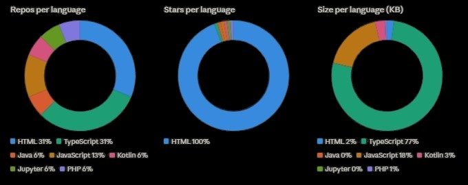

<div align="center">


</div>

---


### 👋 Hey, I'm Anish Kumar R

```java
public class Anish {
    String role     = "CS Undergraduate @ Ramco Institute of Technology";
    String focus    = "Backend Systems & Scalable Architecture";
    String Knowledge  = "DSA • System Design • Real-World Engineering";
    String passion = "CarreerConnect AI :An AI Mock Interview and Resume Analzyer";
    boolean openTo  = true; // Internships & Collaborations
   

    String[] currently = {
        "📐 Designing concurrency-safe APIs",
        "🔍 Cracking complex DSA problems",
        "🚀 Building performant backend systems"
    };
}
```

<br clear="right"/>


### 🛠️ Tech Stack
<div align="center">
<table>
  <tr>
    <td align="left"><b>Languages</b></td>
    <td><a href="https://skillicons.dev"></a></td>
  </tr>
  <tr>
    <td align="left"><b>Frameworks</b></td>
    <td><a href="https://skillicons.dev"></a></td>
  </tr>
  <tr>
    <td align="left"><b>Database</b></td>
    <td><a href="https://skillicons.dev"></a></td>
  </tr>
  <tr>
    <td align="left"><b>DevOps</b></td>
    <td><a href="https://skillicons.dev"></a></td>
  </tr>
    <tr>
    <td align="left"><b>Testing</b></td>
    <td><a href="https://skillicons.dev"></a></td>
  </tr>
</table>

---
</div>
 🚀 Featured Projects

<table>
  <tr>
    
    <td width="100%">
      <h3>🤖 AI Mock Interview & Resume Analyzer</h3>
      <p>LLM-powered mock recruiter that conducts interviews, evaluates candidates, and provides automated feedback with smart job recommendations.</p>
      <p>
        
        
        
      </p>
      <p>
        ✅ LLM-based resume matching<br/>
        ✅ Automated feedback generation<br/>
        ✅ Smart job recommendations
      </p>
    </td>
  </tr>
  <tr>
    <td width="50%">
      <h3>📋 Real-Time On-Duty Monitoring System</h3>
      <p>Web-based approval portal with Role-Based Access Control, automated email notifications, and real-time request tracking.</p>
      <p>
        
        
        
      </p>
      <p>
        ✅ 90% reduction in manual paperwork<br/>
        ✅ 60% faster approval turnaround<br/>
        ✅ Full RBAC implementation
      </p>
    </td>
    <td width="50%">
      <h3>💼 @ HCLTech — Student Intern</h3>
      <p>Java Full-Stack Development internship with hands-on JDBC, JUnit, Hibernate/ORM training. Solved 30+ daily Java challenges on internal platform.</p>
      <p>
        
        
        
      </p>
      <p>
        📅 Jul 2025 – Aug 2025<br/>
        📍 Madurai, India
      </p>
    </td>
  </tr>
</table>

---

### 🏆 Achievements & Certifications
<div align="center">


| 🥇 Hackathons & Contests | 📜 Certifications |
|---|---|
| 🏆 Design Thinking Hackathon **Winner** | Mastering Backend Development — *Udemy* |
| 🔥 Igniters'25 Code Contest **Finalist** | System Design Mastery — *Udemy* |
| 📈 **315th Rank** — LeetCode Weekly Contest | Full Stack Developer — *Udemy* |
| 📈 **250th Rank** — LeetCode Biweekly Contest | Google Cloud Study Jam — *Google Cloud* |
| 🌟 **Top 16%** globally on LeetCode | Postman API Fundamental **Student Expert** |

---
</div>
### 🧠 Core CS Competencies


---

### 📬 Connect with Me
<p align="left">
<a href="mailto:anishrkumar2k5@gmail.com">
  
</a>
<a href="https://linkedin.com/in/anish-kumar-2k5">
  
</a>
<a href="https://github.com/AnishkumarProjects05">
  
</a>
<a href="https://leetcode.com/anish_kumar_2005">
  
</a>
</p>


*"Building systems that scale, solving problems that matter."*

</div>
---

### 📈 Profile Summary
<div align="center">

 ⚡ *Charts below are based on actual repository language data*

</div>

<div align="center">



</div>

### 🥧 Language Distribution

<div align="center">
    
<!--START_SECTION:waka-->
| Language | Repos | Size |
|---|---|---|
| TypeScript | 5 repos | 36 KB |
| HTML | 5 repos | 0.97 KB |
| JavaScript | 2 repos | 8 KB |
| Kotlin | 1 repo | 1.3 KB |
| PHP | 1 repo | 0.27 KB |
| Java | 1 repo | 0.006 KB |
| Jupyter Notebook | 1 repo | 0.003 KB |
<!--END_SECTION:waka-->
</div>

